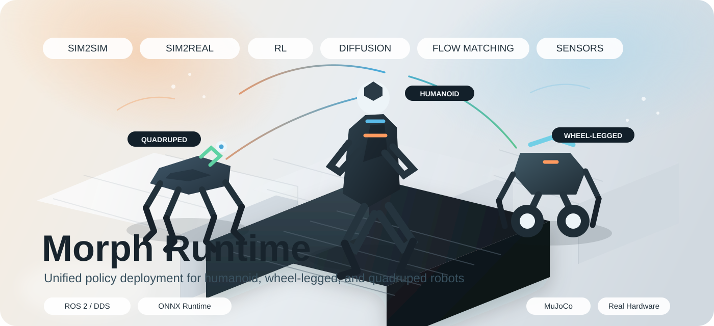

# Morph Runtime

<p align="center">
  
</p>

<p align="center">
  Unified policy deployment runtime for humanoid, wheel-legged, and quadruped robots.
</p>

<p align="center">
  
  
  
  
</p>

Morph Runtime is the deployment shell around the actual controller/runtime
packages already in this repository. The goal is simple: keep one explicit,
inspectable runtime that can serve different robot bodies, different
observation contracts, and different policy families without cloning the whole
stack every time.

It is already being used for:

- `Jingchu01` humanoid policies
- `Unitree G1` humanoid policies
- MuJoCo `sim2sim` validation
- real-robot `sim2real` execution
- RL / AMP / BeyondMimic style policies
- future diffusion or flow-matching style generative policies

## Start Here

### Real robot

```bash
./script/sim2real_engineai.sh --mode-id 0
```

### MuJoCo sim2sim

```bash
./script/sim2sim_engineai.sh \
  --model-path /abs/path/to/robot.xml \
  --mode-id 0 \
  --auto-start-mode
```

### MuJoCo Python viewer frontend

```bash
./script/sim2sim_engineai_python.sh \
  --model-path /abs/path/to/robot.xml \
  --mode-id 0 \
  --auto-start-mode
```

## What Lives Here

- `src/humanoid_rl_controller/rl_master`: fused runtime, policy adapter, observation builder, deploy mode/profile registry
- `src/humanoid_sim2sim/mujoco_sim2sim`: fused MuJoCo backend and Python viewer frontend path
- `src/humanoid_rl_controller/joint_motor_test`: standalone joint/motor trajectory verification tooling
- `script/`: practical operator entry points for sim2real, sim2sim, IMU, joystick, and mode control

## Runtime Principles

- One runtime core, many robots
- One mode/profile system, many policy contracts
- Keep joint-order, observation-order, and reference-order rules explicit
- Keep sim2sim and sim2real as close as possible at runtime boundaries
- Remove split-runtime and hidden legacy paths when they stop paying for themselves

## Operator Entry Points

| Path | Recommended entry |
| --- | --- |
| Real robot fused runtime | `./script/sim2real_engineai.sh --mode-id <N>` |
| MuJoCo fused runtime | `./script/sim2sim_engineai.sh --model-path <xml> --mode-id <N>` |
| MuJoCo Python GUI path | `./script/sim2sim_engineai_python.sh --model-path <xml> --mode-id <N>` |
| Mode control helper | `./script/publish_mode_control.sh start --mode-id <N>` |
| Joystick launcher | `./script/start_joylaunch.sh` |

## Documentation

- Runtime/controller docs:
  [src/humanoid_rl_controller/rl_master/docs/README.md](./src/humanoid_rl_controller/rl_master/docs/README.md)
- Sim2sim docs:
  [src/humanoid_sim2sim/mujoco_sim2sim/docs/README.md](./src/humanoid_sim2sim/mujoco_sim2sim/docs/README.md)
- Script usage:
  [script/README.md](./script/README.md)

## Recent Cleanup Direction

- `sim2real` and `sim2sim` are both centered on fused runtimes now
- legacy `python_interactive` MuJoCo backend is removed
- `joint_motor_test` now injects through `/humanoid/rl/runtime_command`
- old `/humanoid/rl/command` legacy hop is removed

## GitHub Rename Suggestion

If you want the public repository name to match the broader direction of the
project, a good candidate is `morph-runtime`.

GitHub-side rename:

1. Open repository `Settings`
2. Change the repository name
3. Update your local remote

```bash
git remote set-url origin <new-repo-url>
```

The branding can change independently from ROS package names. The package names
in this workspace are intentionally left unchanged for now to avoid a risky
cross-package rename.

## License Status

Repository-wide license selection is still pending maintainer confirmation.
Package-level manifests are not fully normalized yet, so pick the final
repository `LICENSE` deliberately before publishing externally.
