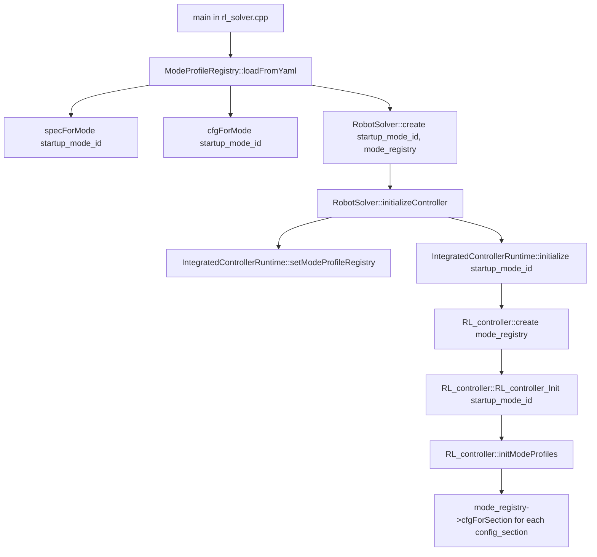
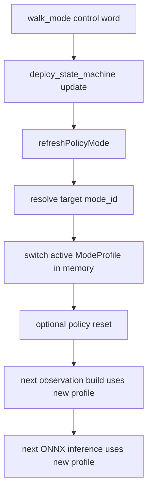

# Runtime End-to-End Function Flow

This document tracks the current runtime call chain after the fused-runtime refactor.

It focuses on four things:

1. where deploy-mode config is loaded
2. when each mode profile is materialized
3. how mode switching works after startup
4. which parts are shared between sim2real and sim2sim

## 1. High-Level Structure

There are now two standard runtime paths:

- real robot: `rl_master/rl_solver` single-process fused runtime
- MuJoCo sim2sim: `mujoco_sim_bridge` single-process fused runtime

Both paths reuse the same controller core:

- `rl_master::runtime::IntegratedControllerRuntime`
- `RL_controller`
- deploy state machine
- observation builder
- ONNX policy runner
- policy-mode switching logic

## 2. Shared Config Loading Model

### 2.1 Real robot fused runtime

The real-robot fused runtime now uses a shared mode registry:



Meaning:

- `deploy_mode_profiles` is parsed once in `ModeProfileRegistry`
- each referenced config section is loaded once into cached `Sim2realCfg`
- `solver` and `controller` both read from that same registry
- mode switching later does not re-read `rl_cfg.yaml`

### 2.2 MuJoCo sim2sim fused runtime

The MuJoCo fused bridge currently calls:

- `controller_runtime_.initialize(startup_mode_id_)`

without explicitly injecting a shared registry first.

That is still functionally correct, because:

- `IntegratedControllerRuntime` creates `RL_controller`
- `RL_controller::initModeProfiles()` lazily creates its own `ModeProfileRegistry` if none was injected

So the control logic is shared, but the real-robot path is one step more explicit:

- real robot: shared registry created in `main()`, then injected downward
- MuJoCo sim2sim: controller-side lazy fallback creates the registry on first initialization

## 3. Shared Runtime Core

The common runtime entry is:

- `rl_master::runtime::IntegratedControllerRuntime`

Core methods:

- `setModeProfileRegistry(std::shared_ptr<const rl_master::ModeProfileRegistry>)`
- `initialize(int startup_mode_id)`
- `step(state, teleop_sample, mode_command_sample)`
- `estop()`

### 3.1 `IntegratedControllerRuntime::initialize(startup_mode_id)`

Current flow:

1. `controller_ = RL_controller::create(mode_registry_)`
2. `controller_->RL_controller_Init(startup_mode_id)`
3. `phase_start_ = now`
4. `mode_command_cache_ = 1000 + controller_->activeModeId()`

Important detail:

- startup mode is now passed into `RL_controller::RL_controller_Init(startup_mode_id)`
- the runtime command cache is initialized from the controller's actual active mode
- this prevents the old mismatch where startup requested one mode but the first control step could still behave like the default profile

### 3.2 `IntegratedControllerRuntime::step(...)`

Per call:

1. update cached teleop if a fresh sample is present
2. update cached mode command if a fresh sample is present
3. compute `phase_t` from `phase_start_`
4. call `controller_->step(state, latest_teleop_, mode_command_cache_, phase_t)`

## 4. RL_controller Internal Flow

### 4.1 Initialization path

`RL_controller::RL_controller_Init(startup_mode_id)`:

1. `initModeProfiles()`
2. resolve and activate the requested startup mode
3. initialize ONNX runners / observation machinery for each loaded mode profile
4. set active runtime profile
5. initialize deploy state machine and zeroing-related internal state

### 4.2 `initModeProfiles()`

Current flow:

1. if `mode_registry_` is empty, create it with `ModeProfileRegistry::loadFromYaml(RL_CFG_PATH, "engineai_walk")`
2. `loadModeProfileSpecsFromYaml()` reads `mode_registry_->specs()`
3. for each `DeployModeProfileSpec`
4. fetch config by `mode_registry_->cfgForSection(spec.config_section)`
5. build runtime `ModeProfile`
6. store it in `mode_profiles_`
7. build `mode_to_profile_index_`

Important detail:

- each runtime `mode_id` still gets its own `ModeProfile`
- but config data now comes from the shared cached registry rather than each caller separately loading YAML

### 4.3 `RL_controller::step(state, command, mode_command, phase_t)`

Main control flow:

1. `updateStateFromIO(state)`
2. `updateCommandFromIO(command)`
3. initialize deploy state machine if first tick
4. `deploy_state_machine_.update(mode_command, now_s, robot->joint_q)`
5. `refreshPolicyMode(...)`
6. `handlePolicySwitch()` if needed
7. depending on lifecycle output:
8. `get_robot_observation(...)`
9. `update_obs_deque(...)`
10. `run_policy(...)`
11. `get_joint_target_q(...)`
12. `get_joint_target_torque(...)`
13. assemble `RobotCommandData`
14. `logStepRecord(...)`

### 4.4 How mode switching works now

After startup, a new mode command does not trigger another YAML reload.

Instead:

1. deploy state machine decodes the incoming control word
2. controller resolves the target `mode_id`
3. controller switches active in-memory `ModeProfile`
4. if configured, policy runtime is reset on mode switch
5. subsequent observation build and ONNX inference use the newly active profile

So:

- startup loading: registry builds all configured profile data
- runtime switching: controller flips between already-built profile objects

Mode switching can be summarized as:



## 5. Sim2Real Function Flow

### 5.1 Entry

- `main()` in [rl_solver.cpp](/home/edify/Code/jc01_deploy/src/humanoid_rl_controller/rl_master/rl_solver.cpp)

### 5.2 Startup

1. `parseStartupModeId(argc, argv)`
2. `ModeProfileRegistry::loadFromYaml(RL_CFG_PATH, "engineai_walk")`
3. `mode_registry->specForMode(startup_mode_id, true)`
4. `mode_registry->cfgForMode(startup_mode_id, true)`
5. configure realtime from startup cfg
6. `RobotSolver::create(startup_mode_id, mode_registry)`
7. `RobotSolver::initModeProfileMap()`
8. `RobotSolver::switchToModeConfig(startup_mode_id, true)`
9. `RobotSolver::initialize()`
10. `motor_shm_io_.connect()`
11. `dds_bridge_.connect()`
12. `RobotSolver::initializeController()`
13. `controller_runtime_.setModeProfileRegistry(mode_registry_)`
14. `controller_runtime_.initialize(active_mode_id_)`

### 5.3 Main loop

Inside `RobotSolver::run()` each cycle:

1. `dds_bridge_.spinOnce()`
2. sample latest `walk_mode`
3. sample latest teleop
4. `getMotorState()`
5. `dds_bridge_.buildRobotStateData(joint_state_, &io_state)`
6. `controller_runtime_.step(io_state, teleop_sample, walk_mode_sample)`
7. `syncRuntimeCfgFromController()`
8. `applyRuntimeCommand(controller_command, true)`
9. if controller active:
10. `dds_bridge_.publishRobotState(io_state)`
11. `sendMotorCmd()`
12. else:
13. latch hold pose if first inactive tick
14. overwrite commands to CSP hold
15. `sendMotorCmd()`
16. `dds_bridge_.publishRobotState(io_state)`

### 5.4 Solver-side mode config switching

`RobotSolver::switchToModeConfig(mode_id, allow_fallback)` now uses the shared registry:

1. `mode_registry_->specForMode(mode_id, allow_fallback)`
2. `mode_registry_->cfgForMode(mode_id, allow_fallback)`
3. copy active `Sim2realCfg` into solver runtime state
4. update derived actuator / hold / limit settings

This means solver-side execution parameters and controller-side policy parameters are selected from the same source of truth.

## 6. Sim2Sim Function Flow

### 6.1 Entry

- `main()` in `src/humanoid_sim2sim/mujoco_sim2sim/src/main.cpp`

### 6.2 Startup

1. `MujocoSimBridge::MujocoSimBridge()`
2. `loadParameters()`
3. `loadModel()`
4. `resolveModelMappings()`
5. `initializeState()`
6. `controller_runtime_.initialize(startup_mode_id_)`
7. `mode_command_cache_ = 1000 + startup_mode_id_`
8. `initializeViewer()`
9. `setupRosInterfaces()`

### 6.3 Main loop

Inside `MujocoSimBridge::controlLoopTick()` each timer tick:

1. `buildRobotState()` from MuJoCo `qpos`, `qvel`, base state
2. `controller_runtime_.step(state, latest_teleop_command_, mode_command_cache_)`
3. `resolveCommandRuntimeMode(...)`
4. if controller inactive:
5. latch current joint pose into `last_target_q_`
6. `updateControlInput(command, control_active, now)`
7. `mj_step(...)` or hold/forward-only path
8. `publishRobotState(buildRobotState())`
9. `renderViewerFrame()`
10. optionally publish Python viewer inspector stream

## 7. Environment-Specific Split

### 7.1 Shared logic

- deploy mode profile selection
- deploy state machine
- observation building
- ONNX inference
- policy switching
- output action interpretation

### 7.2 Real-only logic

- motor shared-memory read/write
- kinematic conversion joint <-> motor
- IMU DDS sampling

### 7.3 Sim-only logic

- MuJoCo `qpos/qvel` extraction
- MuJoCo actuator command write
- optional GLFW viewer rendering
- optional Python viewer frame / inspector publish

## 8. Operator Topics

Shared external inputs:

- `/humanoid/rl/teleop`
- `/humanoid/rl/walk_mode`

Optional observable output:

- `/humanoid/rl/state`

Python frontend sim2sim also uses:

- `/humanoid/sim2sim/mujoco_viewer_frame`
- `/humanoid/sim2sim/mujoco_viewer_inspector`

These remain outside the critical policy-control path.

## 9. Legacy Python Interactive Sim2Sim Flow

This path is still available only for compatibility and comparison.

1. launch standalone `rl_master/RL_controller`
2. launch `mujoco_sim_interactive_backend.py`
3. Python backend publishes `/humanoid/rl/state`
4. standalone controller reads state + teleop + `walk_mode`
5. standalone controller publishes `/humanoid/rl/command`
6. Python backend subscribes command and applies it to MuJoCo

Topology:

```text
RL_controller (legacy standalone process) <-> DDS <-> python_interactive backend
```

This is no longer the standard validation path.
