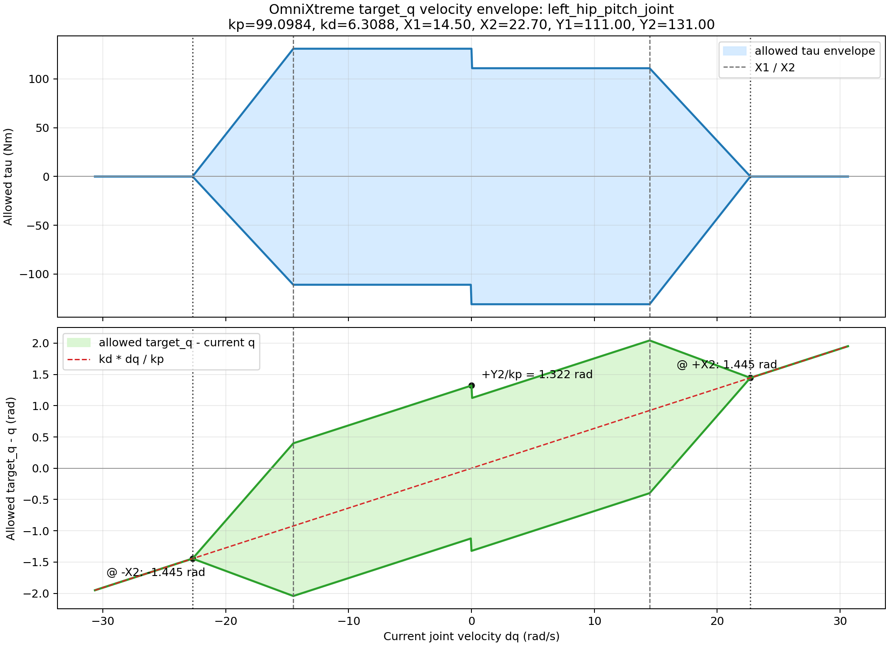

# OmniXtreme `left_hip_pitch_joint` Target-Q Velocity Envelope

This note turns the `target_q_velocity_envelope` settings for `left_hip_pitch_joint`
from [omnixtreme_g1_full_body.yaml](/home/edify/Code/jc01_deploy/src/omnimorph_rl_controller/rl_master/config/profiles/omnixtreme_g1_full_body.yaml)
into a numeric plot and a few deployment-facing interpretations.



## Parameters

For `left_hip_pitch_joint`, the active values are:

| symbol | value | source |
|---|---:|---|
| `kp` | `99.0984` | `kps.left_hip_pitch_joint` |
| `kd` | `6.3088` | `kds.left_hip_pitch_joint` |
| `X1` | `14.5 rad/s` | `target_q_velocity_envelope.x1.left_hip_pitch_joint` |
| `X2` | `22.7 rad/s` | `target_q_velocity_envelope.x2.left_hip_pitch_joint` |
| `Y1` | `111.0 Nm` | `target_q_velocity_envelope.y1.left_hip_pitch_joint` |
| `Y2` | `131.0 Nm` | `target_q_velocity_envelope.y2.left_hip_pitch_joint` |
| `zero_velocity_epsilon` | `0.01 rad/s` | `target_q_velocity_envelope.zero_velocity_epsilon` |

## What The Two Curves Mean

Top plot:

- blue band = allowed PD torque envelope as a function of current joint velocity `dq`
- once `|dq| > X1`, the envelope starts shrinking
- at `|dq| = X2`, the extra P-driven authority collapses to `0`, so only the D-term remains

Bottom plot:

- green band = allowed `target_q - q`
- dashed red line = `kd * dq / kp`
- when `|dq| >= X2`, the envelope collapses onto that dashed line

That means the controller is doing something very specific:

- at low velocity, it allows a wide target position range
- at high velocity, it refuses to let `target_q` continue pushing aggressively in the current motion direction
- but it still allows strong braking / recovery action before the envelope fully collapses

## Formula Used In Deployment

The runtime code path is:

- torque envelope clamp in [RL_controller.cpp](/home/edify/Code/jc01_deploy/src/omnimorph_rl_controller/rl_master/RL_controller.cpp:178)
- application to each policy-generated `target_q` in [RL_controller.cpp](/home/edify/Code/jc01_deploy/src/omnimorph_rl_controller/rl_master/RL_controller.cpp:3497)

The final allowed target range is:

```text
target_q_low  = q + (tau_low  + kd * dq) / kp
target_q_high = q + (tau_high + kd * dq) / kp
```

So the plotted lower and upper bounds are really:

```text
delta_q_low  = target_q_low  - q
delta_q_high = target_q_high - q
```

## Key Numeric Points

For this joint:

1. At `dq = 0`

```text
allowed tau   = [-131.0, +131.0] Nm
allowed delta = [-1.3219, +1.3219] rad
```

So around zero speed, the policy can still move `target_q` by about `+-1.322 rad`
relative to the current joint angle.

2. At `dq = +X1 = +14.5 rad/s`

```text
allowed tau   = [-131.0, +111.0] Nm
allowed delta = [-0.3988, +2.0432] rad
```

This is already asymmetric: the controller is more willing to command a target that
helps brake the positive motion than one that keeps pushing the joint in the opposite
direction.

3. At `dq = +X2 = +22.7 rad/s`

```text
allowed tau   = [0.0, 0.0] Nm
allowed delta = [+1.4451, +1.4451] rad
```

Here the P-envelope has completely collapsed. Only the D-term balance remains, so
`target_q` is forced onto a single value:

```text
target_q - q = kd * dq / kp = 1.4451 rad
```

4. At `dq = -X2 = -22.7 rad/s`

```text
allowed tau   = [0.0, 0.0] Nm
allowed delta = [-1.4451, -1.4451] rad
```

Negative high speed mirrors the positive case.

## Practical Interpretation

For `left_hip_pitch_joint`, this envelope is behaving like a velocity-aware safety shell:

- below `14.5 rad/s`, `target_q` is still fairly free
- between `14.5` and `22.7 rad/s`, the admissible range compresses quickly
- at and beyond `22.7 rad/s`, the controller no longer allows an arbitrary target position;
  it locks onto the D-term balance line

That is exactly the behavior you usually want when a generative policy can produce
aggressive targets:

- keep low-speed motion expressive
- reduce high-speed chasing
- preserve braking authority

## Reproduce

The plot was generated with:

- [plot_target_q_velocity_envelope.py](/home/edify/Code/jc01_deploy/src/omnimorph_rl_controller/rl_master/tools/plot_target_q_velocity_envelope.py)

Example:

```bash
python3 src/omnimorph_rl_controller/rl_master/tools/plot_target_q_velocity_envelope.py \
  --profile src/omnimorph_rl_controller/rl_master/config/profiles/omnixtreme_g1_full_body.yaml \
  --profile-name omnixtreme_g1_full_body \
  --joint left_hip_pitch_joint \
  --output src/omnimorph_rl_controller/rl_master/docs/assets/omnixtreme_left_hip_pitch_target_q_velocity_envelope.png
```
